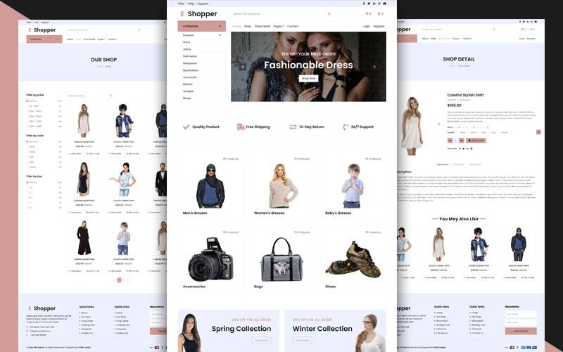

# EShopper — Bootstrap Shop Template



## Live Demo

[View the demo](https://rskworld.in/web/html-templates/ecommerce-templates/eshopper/index.php)

## Overview

EShopper is a responsive Bootstrap eCommerce UI template featuring ready-made pages for common storefront flows. It includes homepage sections, product grids, product details, cart, checkout, and contact pages, along with reusable components and utilities.

## Pages Included

- Home: `index.html`
- Shop: `shop.html`
- Product Detail: `detail.html`
- Cart: `cart.html`
- Checkout: `checkout.html`
- Contact: `contact.html`

## Directory Structure

```
file/
  index.html
  shop.html
  detail.html
  cart.html
  checkout.html
  contact.html
  css/
    style.css
  js/
    main.js
  lib/
    easing/
    owlcarousel/
  img/
  scss/
    style.scss
  mail/
    contact.php
```

## Quick Start

1. Open `file/index.html` directly in your browser, or serve the project via a local web server.
2. To view the hosted example, use the demo link above.

### Optional: SCSS → CSS

If you want to customize styles using SCSS, compile `scss/style.scss` to `css/style.css` with your preferred Sass compiler, for example:

```
sass scss/style.scss css/style.css --no-source-map --style=compressed
```

## Dependencies

- Bootstrap styles (SCSS source included under `scss/bootstrap/`)
- Owl Carousel (`lib/owlcarousel`)
- jQuery Easing (`lib/easing`)

These are already wired in the HTML files.

## Credits

- Template by [HTML Codex](https://htmlcodex.com)


## Support / Licensing / Custom Dev

Support / Licensing / Custom Dev: help@rskworld.in | Phone/WhatsApp: +91 9330539277 | Website: rskworld.in | Business Inquiries: help@rskworld.in | 🤝 Suggestions and improvements are welcome!
